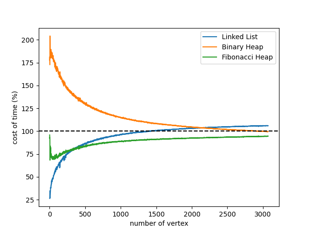

堆优化的最短路算法
===============

**作者:** *金俊一 张延泽 童盟*
**日期:** *2024-03-29*

# 第一章: 引言
## 戴克斯特拉算法
### 伪代码
```pseudocode
FUNCTION Dijkstra(G, w, s)
  INITIALIZE-SINGLE-SOURCE(G, s)
  S <- NULL
  Q <- s
  while (Q != NULL)
    do u <- EXTRACT - MIN(Q)
    S <- UNION(S, u)
    for each vertex v IN Adj[u]
      do RELAX(u, v, w)
```
### 复杂度分析
下面是一些戴克斯特拉算法经典实现的复杂度比较： 

|算法|最坏时间复杂度|
|:-:|:-:|
|使用邻接表的戴克斯特拉算法|$O(\|V\|^2)$|
|使用二叉堆优化的戴克斯特拉算法| $O((\|E\|+\|V\|)log\|V\|)$ |
|使用斐波那契堆优化的戴克斯特拉算法 | $O(\|E\|+\|V\|log\|V\|)$ |

---

# 第二章: 数据结构与算法分析
## 链接表
### 伪代码
```pseudocode
STRUCTURE ListNode:
  index: size_t
  value: unsigned long long
  prev: pointer to ListNode
  next: pointer to ListNode

STRUCTURE LinkedList:
  head: pointer to ListNode

  FUNCTION CREATE-LINKED-LIST():
    list <- new LinkedList with head = NULL
    RETURN list

  FUNCTION DESTROY-LINKED-LIST(list):
    current <- list.head
    WHILE current != NULL
      next <- current.next
      DELETE current
      current <- next

  FUNCTION POP-MIN(list):
    minNode <- NULL
    minIndex <- -1
    minValue <- ULONG_MAX
    current <- list.head
    WHILE current != NULL
      IF current.value < minValue THEN
        minNode <- current
        minIndex <- current.index
        minValue <- current.value
      current <- current.next
    IF minNode != NULL THEN
      IF minNode.prev != NULL THEN minNode.prev.next <- minNode.next
      IF minNode.next != NULL THEN minNode.next.prev <- minNode.prev
      IF minNode == list.head THEN list.head <- minNode.next
      DELETE minNode
    RETURN (minIndex, minValue)

  FUNCTION PUSH(list, index, value):
    newNode <- CREATE-NODE(index, value)
    IF list.head != NULL THEN list.head.prev <- newNode
    newNode.next <- list.head
    list.head <- newNode

  FUNCTION DECREASE(list, index, value):
    current <- list.head
    WHILE current != NULL
      IF current.index == index THEN
        current.value <- value
        BREAK
      current <- current.next
```
### 复杂度分析
在上述的 Dijkstra 算法中，主要的时间复杂度来自于优先队列的实现。在这里，我们使用了链表作为优先队列的数据结构。假设有 \(V\) 个顶点和 \(E\) 条边。

1. **初始化**：对每个顶点的初始化操作的时间复杂度为 \(O(V)\)。
2. **主循环**：主循环执行 \(V\) 次，每次从优先队列中提取最小值，时间复杂度为 \(O(V)\)。
3. **Relax 操作**：对每条边进行 Relax 操作，最坏情况下会被执行 \(E\) 次，时间复杂度为 \(O(E)\)。
4. **优先队列操作**：由于使用链表实现优先队列，提取最小值的时间复杂度为 \(O(V)\)，而 decrease 操作的时间复杂度为 \(O(V)\)。

综上所述，Dijkstra 算法的时间复杂度为 \(O((V + E) \cdot V)\)，其中 \(E\) 可能的最大取值为 \(V^2\)，因此可以简化为 \(O(V^2)\)。

## 二叉堆
### 伪代码
```pseudocode
STRUCTURE BinaryHeap:
  values: list of unsigned long long
  indexes: map from size_t to size_t
  places: map from size_t to size_t

  FUNCTION PARENT(place):
    RETURN (place-1) / 2

  FUNCTION LEFT(place):
    RETURN 2 * place + 1

  FUNCTION RIGHT(place):
    RETURN 2 * place + 2

  FUNCTION SWAP(place1, place2):
    tempValue <- values[place1]
    values[place1] <- values[place2]
    values[place2] <- tempValue

    index1 <- indexes[place1]
    index2 <- indexes[place2]
    indexes[place1] <- index2
    indexes[place2] <- index1
    places[index1] <- place2
    places[index2] <- place1

  FUNCTION SWAP-DOWN(place):
    l <- LEFT(place)
    r <- RIGHT(place)
    smallest <- place
    IF l < values.length AND values[l] < values[smallest] THEN
      smallest <- l
    IF r < values.length AND values[r] < values[smallest] THEN
      smallest <- r
    WHILE smallest != place
      SWAP(place, smallest)
      place <- smallest
      l <- LEFT(place)
      r <- RIGHT(place)
      IF l < values.length AND values[l] < values[smallest] THEN
        smallest <- l
      IF r < values.length AND values[r] < values[smallest] THEN
        smallest <- r

  FUNCTION SWAP-UP(place):
    WHILE place != 0 AND values[PARENT(place)] > values[place]
      SWAP(place, PARENT(place))
      place <- PARENT(place)

  FUNCTION CREATE-BINARY-HEAP():
    heap <- new BinaryHeap with values = {}, indexes = {}, places = {}
    RETURN heap

  FUNCTION POP-MIN(heap):
    IF heap.values.length == 0 THEN
      RETURN (-1, ULONG_MAX)
    value <- heap.values[0]
    index <- heap.indexes[0]
    heap.values[0] <- heap.values[heap.values.length - 1]
    heap.indexes[0] <- heap.indexes[heap.values.length - 1]
    heap.places[heap.indexes[0]] <- 0
    heap.values.pop_back()
    heap.indexes.erase(heap.values.length)
    heap.places.erase(index)
    SWAP-DOWN(0)
    RETURN (index, value)

  FUNCTION PUSH(heap, index, value):
    place <- heap.values.length
    heap.places[index] <- place
    heap.indexes[place] <- index
    heap.values.push_back(value)
    SWAP-UP(place)

  FUNCTION DECREASE(heap, index, value):
    place <- heap.places[index]
    heap.values[place] <- value
    SWAP-UP(place)
```
### 复杂度分析
在上述的 Dijkstra 算法中，主要的时间复杂度仍然取决于优先队列的实现，即 `binaryHeap` 类。

1. **初始化**：对于 `binaryHeap` 类的初始化操作的时间复杂度为 O(1)，因为只是创建了一个空的容器。
2. **主循环**：主循环执行 V 次，每次从优先队列中提取最小值，时间复杂度为 O(log V)，因为这个操作涉及到一次 swap-down 操作。
3. **Relax 操作**：对每条边进行 Relax 操作，最坏情况下会被执行 E 次，时间复杂度为 O(E log V)，因为每次 Relax 都会涉及到 decrease 操作。
4. **优先队列操作**：从优先队列中删除最小值的时间复杂度为 O(log V)，插入新元素的时间复杂度为 O(log V)，因此总体时间复杂度为 O(log V)。

综上所述，Dijkstra 算法的时间复杂度为 O((V + E) log V)，其中 V 是顶点的数量，E 是边的数量。

## 斐波那契堆
### 伪代码
```pseudocode
STRUCTURE FibonacciNode:
  key: pair of size_t and unsigned long long
  degree: size_t
  left: pointer to FibonacciNode
  right: pointer to FibonacciNode
  parent: pointer to FibonacciNode
  child: pointer to FibonacciNode
  marked: boolean

STRUCTURE FibonacciHead:
  keyNum: size_t
  maxDegree: size_t
  min: pointer to FibonacciNode

STRUCTURE FibonacciHeap:
  head: pointer to FibonacciHead
  nodes: map from size_t to pointer to FibonacciNode

  FUNCTION REMOVE-NODE(node):
    node.left.right <- node.right
    node.right.left <- node.left

  FUNCTION ADD-NODE(node, root):
    node.left <- root
    node.right <- root.right
    root.right.left <- node
    root.right <- node

  FUNCTION ERASE-CHILDREN(root):
    FOR i <- 0 TO root.degree
      current <- root.child
      root.child <- current.right
      current.parent <- NULL
      REMOVE-NODE(current)
      IF head.min == NULL THEN
        head.min <- current
        current.left <- current.right <- current
      ELSE ADD-NODE(current, head.min)
      current <- current.right
    root.degree <- 0
    root.child <- NULL

  FUNCTION CREATE-FIBONACCI-HEAP():
    heap <- new FibonacciHeap with head.keyNum = 0, head.maxDegree = 0, head.min = NULL, nodes = {}
    RETURN heap

  FUNCTION POP-MIN(heap):
    IF head.min == NULL THEN
      RETURN (-1, ULONG_MAX)
    minNode <- head.min
    ERASE-CHILDREN(minNode)
    IF minNode.right == minNode THEN head.min <- NULL
    ELSE
      minSilbing <- minNode.right
      minValue <- ULONG_MAX
      WHILE minSilbing != minNode
        IF minValue > minSilbing.key.second THEN
          minValue <- minSilbing.key.second
          head.min <- minSilbing
        minSilbing <- minSilbing.right
      END WHILE
    END IF
    REMOVE-NODE(minNode)
    head.keyNum <- head.keyNum - 1
    minKey <- minNode.key
    nodes.erase(minKey.first)
    DELETE minNode
    IF head.min != NULL THEN
      minNode <- head.min
      cons <- vector of FibonacciNode pointers, with size of log2(head.keyNum)+1, initialized to NULL
      minSilbing <- minNode
      next <- minNode.right
      WHILE next != minNode
        occupied <- cons[minSilbing.degree]
        WHILE occupied != NULL
          cons[minSilbing.degree] <- NULL
          IF occupied.key.second <= minSilbing.key.second THEN
            occupied.degree <- occupied.degree + 1
            REMOVE-NODE(minSilbing)
            minSilbing.parent <- occupied
            IF occupied.child == NULL THEN
              occupied.child <- minSilbing
              minSilbing.left <- minSilbing.right <- minSilbing
            ELSE ADD-NODE(minSilbing, occupied.child)
            END IF
          ELSE
            minSilbing.degree <- minSilbing.degree + 1
            REMOVE-NODE(occupied)
            occupied.parent <- minSilbing
            IF minSilbing.child == NULL THEN
              minSilbing.child <- occupied
              occupied.left <- occupied.right <- occupied
            ELSE ADD-NODE(occupied, minSilbing.child)
            END IF
          END IF
        END WHILE
        minSilbing <- next
        next <- next.right
      END WHILE
    END IF
    RETURN minKey

  FUNCTION PUSH(heap, index, value):
    current <- new FibonacciNode with key = (index, value), degree = 0, left = right = current, parent = child = NULL, marked = false
    nodes[index] <- current
    IF head.min == NULL THEN head.min <- current
    ELSE
      ADD-NODE(current, head.min)
      IF head.min.key.second > current.key.second THEN head.min <- current
    END IF
    head.keyNum <- head.keyNum + 1

  FUNCTION DECREASE(heap, index, value):
    current <- nodes[index]
    current.key.second <- value
    WHILE current.parent != NULL AND current.parent.key.second > current.key.second
      temp <- current.key
      current.key <- current.parent.key
      current.parent.key <- temp
      nodes[current.key.first] <- current
      current <- current.parent
      nodes[current.key.first] <- current
    IF head.min.key.second > value THEN head.min <- current
```

### 复杂度分析
在使用斐波那契堆实现 Dijkstra 算法时，我们需要分析以下几个方面的复杂度：

1. **初始化**：创建斐波那契堆的时间复杂度为 O(1)，因为只是创建了一个空的容器，而不涉及对节点的任何操作。

2. **插入节点**：将节点插入斐波那契堆的时间复杂度为 O(1)，因为只需要将节点添加到堆的根链表中，而不需要任何重新平衡的操作。

3. **减小节点值**：对一个节点的值进行减小的操作需要沿着其父节点的路径向上遍历，并且在需要时调整树结构。在最坏情况下，该操作的时间复杂度为 O(log V)，其中 V 是堆中节点的数量。

4. **删除最小值节点**：删除斐波那契堆中的最小值节点的时间复杂度为 O(log V)，其中 V 是堆中节点的数量。在该操作中，我们需要合并堆中的根链表，并且可能需要进行级联剪切和级联合并操作以维护斐波那契堆的性质。

5. **Relax 操作**：对于每个顶点，我们需要执行 Relax 操作以更新到达每个邻接顶点的最短路径。由于 Relax 操作涉及到减小节点值，因此 Relax 操作的时间复杂度为 O(log V)。

综上所述，基于斐波那契堆的 Dijkstra 算法的时间复杂度为 O(E + V log V)，其中 V 是顶点的数量，E 是边的数量。相比于基于二叉堆的实现，斐波那契堆的实现能够在实际应用中更快地收敛，但由于其常数偏大，所以需要在较大的图上才能体现出优势。

---

# 第三章: 测试结果
测试结果的具体数据请参考项目文件夹下 code/test/output.csv
以下为其的可视化结果:

结果以三种数据结构所用的平均时长作为参考,绘制了三种数据结构所用时长与平均时长地比值
黑色虚线所表明的为平均用时，高于黑色虚线的为高于平均用时,地于黑色虚线为低于平均用时

---

# 第四章: 分析与评价
## 结果分析
通过可视化结果可以看出实验结果与理论上的时间复杂度相当
同时可以观察到在图节点数较少时,链接表用时较优,这是因为无论二叉堆或是斐波那契堆的常数项都较大导致的
而可以看到在图节点变大时,二叉堆与斐波那契堆的优势就得以体现,同时二者较为接近
同时,可以发现所用的时间存在明显波动,这是因为实验为了体现二叉堆与斐波那契堆的优势采用了完全连接图,同时边长也是随机设定的,使得寻路上存在随机性
而在实验时若是取多次实验的平均值即可较好地消除波动,但这会耗费大量的时间
## 实验评价
实验对边长的随机选取为在 0 到节点数之间均匀选取,这会导致在有些图当中出现很快到达最终节点的情况(比如初始节点与最终节点边长为 0),导致了实验的最终数据呈现出较大的波动
同时实验直接用链接表储存图,对内存的优化并不是很好,由于二叉堆与斐波那契堆的常数值较大,所以在测试时希望较可能地调大节点数,但总是造成内存不够,但最终仍然体现了二叉堆与斐波那契堆的优势

---

# 附录: 源代码
源代码部分已在项目中给出,请参照项目文件夹下 code/project 文件夹

---

# 声明

特此声明,题为"堆优化的最短路算法"的项目系小组原创,未有借鉴或抄袭
======================================================

---

# 签字

---
