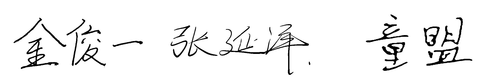

堆优化的最短路算法
===============

**作者:** *金俊一 张延泽 童盟*
**日期:** *2024-03-29*

# 第一章: 引言
## 戴克斯特拉算法
### 伪代码
```pseudocode
FUNCTION Dijkstra(G, w, s)
  INITIALIZE-SINGLE-SOURCE(G, s)
  S <- NULL
  Q <- s
  while (Q != NULL)
    do u <- EXTRACT - MIN(Q)
    S <- UNION(S, u)
    for each vertex v IN Adj[u]
      do RELAX(u, v, w)
```
### 复杂度分析
下面是一些戴克斯特拉算法经典实现的复杂度比较： 

|算法|最坏时间复杂度|
|:-:|:-:|
|使用邻接表的戴克斯特拉算法|$O(\|V\|^2)$|
|使用二叉堆优化的戴克斯特拉算法| $O((\|E\|+\|V\|)log\|V\|)$ |
|使用斐波那契堆优化的戴克斯特拉算法 | $O(\|E\|+\|V\|log\|V\|)$ |

---

# 第二章: 数据结构与算法分析
## 链接表
### 伪代码
```pseudocode
STRUCTURE ListNode:
  index: size_t
  value: unsigned long long
  prev: pointer to ListNode
  next: pointer to ListNode

STRUCTURE LinkedList:
  head: pointer to ListNode

  FUNCTION CREATE-LINKED-LIST():
    list <- new LinkedList with head = NULL
    RETURN list

  FUNCTION DESTROY-LINKED-LIST(list):
    current <- list.head
    WHILE current != NULL
      next <- current.next
      DELETE current
      current <- next

  FUNCTION POP-MIN(list):
    minNode <- NULL
    minIndex <- -1
    minValue <- ULONG_MAX
    current <- list.head
    WHILE current != NULL
      IF current.value < minValue THEN
        minNode <- current
        minIndex <- current.index
        minValue <- current.value
      current <- current.next
    IF minNode != NULL THEN
      IF minNode.prev != NULL THEN minNode.prev.next <- minNode.next
      IF minNode.next != NULL THEN minNode.next.prev <- minNode.prev
      IF minNode == list.head THEN list.head <- minNode.next
      DELETE minNode
    RETURN (minIndex, minValue)

  FUNCTION PUSH(list, index, value):
    newNode <- CREATE-NODE(index, value)
    IF list.head != NULL THEN list.head.prev <- newNode
    newNode.next <- list.head
    list.head <- newNode

  FUNCTION DECREASE(list, index, value):
    current <- list.head
    WHILE current != NULL
      IF current.index == index THEN
        current.value <- value
        BREAK
      current <- current.next
```
### 复杂度分析
在上述的 Dijkstra 算法中，主要的时间复杂度来自于优先队列的实现。在这里，我们使用了链表作为优先队列的数据结构。假设有 \(V\) 个顶点和 \(E\) 条边。

1. **初始化**：对每个顶点的初始化操作的时间复杂度为 \(O(V)\)。
2. **主循环**：主循环执行 \(V\) 次，每次从优先队列中提取最小值，时间复杂度为 \(O(V)\)。
3. **Relax 操作**：对每条边进行 Relax 操作，最坏情况下会被执行 \(E\) 次，时间复杂度为 \(O(E)\)。
4. **优先队列操作**：由于使用链表实现优先队列，提取最小值的时间复杂度为 \(O(V)\)，而 decrease 操作的时间复杂度为 \(O(V)\)。

综上所述，Dijkstra 算法的时间复杂度为 \(O((V + E) \cdot V)\)，其中 \(E\) 可能的最大取值为 \(V^2\)，因此可以简化为 \(O(V^2)\)。

## 二叉堆
### 伪代码
```pseudocode
STRUCTURE BinaryHeap:
  values: list of unsigned long long
  indexes: map from size_t to size_t
  places: map from size_t to size_t

  FUNCTION PARENT(place):
    RETURN (place-1) / 2

  FUNCTION LEFT(place):
    RETURN 2 * place + 1

  FUNCTION RIGHT(place):
    RETURN 2 * place + 2

  FUNCTION SWAP(place1, place2):
    tempValue <- values[place1]
    values[place1] <- values[place2]
    values[place2] <- tempValue

    index1 <- indexes[place1]
    index2 <- indexes[place2]
    indexes[place1] <- index2
    indexes[place2] <- index1
    places[index1] <- place2
    places[index2] <- place1

  FUNCTION SWAP-DOWN(place):
    l <- LEFT(place)
    r <- RIGHT(place)
    smallest <- place
    IF l < values.length AND values[l] < values[smallest] THEN
      smallest <- l
    IF r < values.length AND values[r] < values[smallest] THEN
      smallest <- r
    WHILE smallest != place
      SWAP(place, smallest)
      place <- smallest
      l <- LEFT(place)
      r <- RIGHT(place)
      IF l < values.length AND values[l] < values[smallest] THEN
        smallest <- l
      IF r < values.length AND values[r] < values[smallest] THEN
        smallest <- r

  FUNCTION SWAP-UP(place):
    WHILE place != 0 AND values[PARENT(place)] > values[place]
      SWAP(place, PARENT(place))
      place <- PARENT(place)

  FUNCTION CREATE-BINARY-HEAP():
    heap <- new BinaryHeap with values = {}, indexes = {}, places = {}
    RETURN heap

  FUNCTION POP-MIN(heap):
    IF heap.values.length == 0 THEN
      RETURN (-1, ULONG_MAX)
    value <- heap.values[0]
    index <- heap.indexes[0]
    heap.values[0] <- heap.values[heap.values.length - 1]
    heap.indexes[0] <- heap.indexes[heap.values.length - 1]
    heap.places[heap.indexes[0]] <- 0
    heap.values.pop_back()
    heap.indexes.erase(heap.values.length)
    heap.places.erase(index)
    SWAP-DOWN(0)
    RETURN (index, value)

  FUNCTION PUSH(heap, index, value):
    place <- heap.values.length
    heap.places[index] <- place
    heap.indexes[place] <- index
    heap.values.push_back(value)
    SWAP-UP(place)

  FUNCTION DECREASE(heap, index, value):
    place <- heap.places[index]
    heap.values[place] <- value
    SWAP-UP(place)
```
### 复杂度分析
在上述的 Dijkstra 算法中，主要的时间复杂度仍然取决于优先队列的实现，即 `binaryHeap` 类。

1. **初始化**：对于 `binaryHeap` 类的初始化操作的时间复杂度为 O(1)，因为只是创建了一个空的容器。
2. **主循环**：主循环执行 V 次，每次从优先队列中提取最小值，时间复杂度为 O(log V)，因为这个操作涉及到一次 swap-down 操作。
3. **Relax 操作**：对每条边进行 Relax 操作，最坏情况下会被执行 E 次，时间复杂度为 O(E log V)，因为每次 Relax 都会涉及到 decrease 操作。
4. **优先队列操作**：从优先队列中删除最小值的时间复杂度为 O(log V)，插入新元素的时间复杂度为 O(log V)，因此总体时间复杂度为 O(log V)。

综上所述，Dijkstra 算法的时间复杂度为 O((V + E) log V)，其中 V 是顶点的数量，E 是边的数量。

## 斐波那契堆
### 伪代码
```pseudocode
STRUCTURE FibonacciNode:
  key: pair of size_t and unsigned long long
  degree: size_t
  left: pointer to FibonacciNode
  right: pointer to FibonacciNode
  parent: pointer to FibonacciNode
  child: pointer to FibonacciNode
  marked: boolean

STRUCTURE FibonacciHead:
  keyNum: size_t
  maxDegree: size_t
  min: pointer to FibonacciNode

STRUCTURE FibonacciHeap:
  head: pointer to FibonacciHead
  nodes: map from size_t to pointer to FibonacciNode

  FUNCTION REMOVE-NODE(node):
    node.left.right <- node.right
    node.right.left <- node.left

  FUNCTION ADD-NODE(node, root):
    node.left <- root
    node.right <- root.right
    root.right.left <- node
    root.right <- node

  FUNCTION ERASE-CHILDREN(root):
    FOR i <- 0 TO root.degree
      current <- root.child
      root.child <- current.right
      current.parent <- NULL
      REMOVE-NODE(current)
      IF head.min == NULL THEN
        head.min <- current
        current.left <- current.right <- current
      ELSE ADD-NODE(current, head.min)
      current <- current.right
    root.degree <- 0
    root.child <- NULL

  FUNCTION CREATE-FIBONACCI-HEAP():
    heap <- new FibonacciHeap with head.keyNum = 0, head.maxDegree = 0, head.min = NULL, nodes = {}
    RETURN heap

  FUNCTION POP-MIN(heap):
    IF head.min == NULL THEN
      RETURN (-1, ULONG_MAX)
    minNode <- head.min
    ERASE-CHILDREN(minNode)
    IF minNode.right == minNode THEN head.min <- NULL
    ELSE
      minSilbing <- minNode.right
      minValue <- ULONG_MAX
      WHILE minSilbing != minNode
        IF minValue > minSilbing.key.second THEN
          minValue <- minSilbing.key.second
          head.min <- minSilbing
        minSilbing <- minSilbing.right
      END WHILE
    END IF
    REMOVE-NODE(minNode)
    head.keyNum <- head.keyNum - 1
    minKey <- minNode.key
    nodes.erase(minKey.first)
    DELETE minNode
    IF head.min != NULL THEN
      minNode <- head.min
      cons <- vector of FibonacciNode pointers, with size of log2(head.keyNum)+1, initialized to NULL
      minSilbing <- minNode
      next <- minNode.right
      WHILE next != minNode
        occupied <- cons[minSilbing.degree]
        WHILE occupied != NULL
          cons[minSilbing.degree] <- NULL
          IF occupied.key.second <= minSilbing.key.second THEN
            occupied.degree <- occupied.degree + 1
            REMOVE-NODE(minSilbing)
            minSilbing.parent <- occupied
            IF occupied.child == NULL THEN
              occupied.child <- minSilbing
              minSilbing.left <- minSilbing.right <- minSilbing
            ELSE ADD-NODE(minSilbing, occupied.child)
            END IF
          ELSE
            minSilbing.degree <- minSilbing.degree + 1
            REMOVE-NODE(occupied)
            occupied.parent <- minSilbing
            IF minSilbing.child == NULL THEN
              minSilbing.child <- occupied
              occupied.left <- occupied.right <- occupied
            ELSE ADD-NODE(occupied, minSilbing.child)
            END IF
          END IF
        END WHILE
        minSilbing <- next
        next <- next.right
      END WHILE
    END IF
    RETURN minKey

  FUNCTION PUSH(heap, index, value):
    current <- new FibonacciNode with key = (index, value), degree = 0, left = right = current, parent = child = NULL, marked = false
    nodes[index] <- current
    IF head.min == NULL THEN head.min <- current
    ELSE
      ADD-NODE(current, head.min)
      IF head.min.key.second > current.key.second THEN head.min <- current
    END IF
    head.keyNum <- head.keyNum + 1

  FUNCTION DECREASE(heap, index, value):
    current <- nodes[index]
    current.key.second <- value
    WHILE current.parent != NULL AND current.parent.key.second > current.key.second
      temp <- current.key
      current.key <- current.parent.key
      current.parent.key <- temp
      nodes[current.key.first] <- current
      current <- current.parent
      nodes[current.key.first] <- current
    IF head.min.key.second > value THEN head.min <- current
```

### 复杂度分析
在使用斐波那契堆实现 Dijkstra 算法时，我们需要分析以下几个方面的复杂度：

1. **初始化**：创建斐波那契堆的时间复杂度为 O(1)，因为只是创建了一个空的容器，而不涉及对节点的任何操作。

2. **插入节点**：将节点插入斐波那契堆的时间复杂度为 O(1)，因为只需要将节点添加到堆的根链表中，而不需要任何重新平衡的操作。

3. **减小节点值**：对一个节点的值进行减小的操作需要沿着其父节点的路径向上遍历，并且在需要时调整树结构。在最坏情况下，该操作的时间复杂度为 O(log V)，其中 V 是堆中节点的数量。

4. **删除最小值节点**：删除斐波那契堆中的最小值节点的时间复杂度为 O(log V)，其中 V 是堆中节点的数量。在该操作中，我们需要合并堆中的根链表，并且可能需要进行级联剪切和级联合并操作以维护斐波那契堆的性质。

5. **Relax 操作**：对于每个顶点，我们需要执行 Relax 操作以更新到达每个邻接顶点的最短路径。由于 Relax 操作涉及到减小节点值，因此 Relax 操作的时间复杂度为 O(log V)。

综上所述，基于斐波那契堆的 Dijkstra 算法的时间复杂度为 O(E + V log V)，其中 V 是顶点的数量，E 是边的数量。相比于基于二叉堆的实现，斐波那契堆的实现能够在实际应用中更快地收敛，但由于其常数偏大，所以需要在较大的图上才能体现出优势。

---

# 第三章: 测试结果
测试结果的具体数据请参考项目文件夹下 code/test/output.csv
以下为其的可视化结果:

结果以三种数据结构所用的平均时长作为参考,绘制了三种数据结构所用时长与平均时长地比值
黑色虚线所表明的为平均用时，高于黑色虚线的为高于平均用时,地于黑色虚线为低于平均用时

---

# 第四章: 分析与评价
## 结果分析
通过可视化结果可以看出实验结果与理论上的时间复杂度相当
同时可以观察到在图节点数较少时,链接表用时较优,这是因为无论二叉堆或是斐波那契堆的常数项都较大导致的
而可以看到在图节点变大时,二叉堆与斐波那契堆的优势就得以体现,同时二者较为接近
同时,可以发现所用的时间存在明显波动,这是因为实验为了体现二叉堆与斐波那契堆的优势采用了完全连接图,同时边长也是随机设定的,使得寻路上存在随机性
而在实验时若是取多次实验的平均值即可较好地消除波动,但这会耗费大量的时间
## 实验评价
实验对边长的随机选取为在 0 到节点数之间均匀选取,这会导致在有些图当中出现很快到达最终节点的情况(比如初始节点与最终节点边长为 0),导致了实验的最终数据呈现出较大的波动
同时实验直接用链接表储存图,对内存的优化并不是很好,由于二叉堆与斐波那契堆的常数值较大,所以在测试时希望较可能地调大节点数,但总是造成内存不够,但最终仍然体现了二叉堆与斐波那契堆的优势

---

# 附录: 源代码
## 链接表
### linkedList.hpp
```cpp
#include <cstddef>   // Provides definitions for size_t
#include <climits>   // Provides constants for limits of integral types
#include <utility>   // Provides std::pair and std::make_pair

#define ull unsigned long long   // Define ull as an alias for unsigned long long

using namespace std;   // Using the standard namespace

// Definition of the linkedList class
class linkedList {
private:
  // Definition of a private nested struct listNode
  struct listNode {
    size_t index = -1;          // Index of the node initialized to -1
    ull value = ULLONG_MAX;     // Value of the node initialized to maximum value of ull
    listNode* prev = nullptr;   // Pointer to the previous node initialized to nullptr
    listNode* next = nullptr;   // Pointer to the next node initialized to nullptr
  };
  listNode* head = nullptr;     // Pointer to the head of the linked list initialized to nullptr
public:
  linkedList();                 // Constructor declaration
  ~linkedList();                // Destructor declaration
  pair<size_t, ull> popMin();   // Method to remove and return the node with minimum value
  void push(size_t index, ull value);   // Method to insert a new node at the beginning
  void decrease(size_t index, ull value);   // Method to update the value of a node given its index
};
```
### linkedList.cpp
```cpp
#include "linkedList.hpp"

// Constructor definition
linkedList::linkedList() {}

// Destructor definition
linkedList::~linkedList() {
  listNode* current = this->head;   // Start from the head of the linked list
  while (current != nullptr) {      // Loop until the end of the list is reached
    this->head = current->next;     // Move head to the next node
    delete current;                 // Delete the current node
    current = this->head;           // Move to the next node
  }
}

// Method to remove and return the node with minimum value
pair<size_t, ull> linkedList::popMin() {
  listNode* minNode = nullptr;      // Pointer to the node with minimum value initialized to nullptr
  size_t minIndex = -1;             // Index of the node with minimum value initialized to -1
  ull minValue = ULLONG_MAX;        // Minimum value initialized to maximum value of ull
  // Iterate through the linked list to find the node with minimum value
  for (listNode* current = this->head; current != nullptr; current = current->next)
    if (current->value < minValue) {
      minNode = current;
      minIndex = current->index;
      minValue = current->value;
    }
  // If a node with minimum value is found, remove it from the list
  if (minNode != nullptr) {
    if (minNode->prev != nullptr) minNode->prev->next = minNode->next;
    if (minNode->next != nullptr) minNode->next->prev = minNode->prev;
    if (minNode == this->head) this->head = minNode->next;
    delete minNode;
  }
  // Return the index and value of the removed node as a pair
  return make_pair(minIndex, minValue);
}

// Method to insert a new node at the beginning of the linked list
void linkedList::push(size_t index, ull value) {
  listNode* current = new listNode;   // Create a new node
  current->index = index;             // Set its index
  current->value = value;             // Set its value
  if (this->head != nullptr) this->head->prev = current;   // Update the previous pointer of the current head
  current->next = this->head;         // Set the next pointer of the new node to the current head
  this->head = current;               // Update the head to point to the new node
}

// Method to update the value of a node given its index
void linkedList::decrease(size_t index, ull value) {
  listNode* current = this->head;     // Start from the head of the linked list
  // Iterate through the list to find the node with the given index
  while (current != nullptr) {
    if (current->index == index) {
      current->value = value;         // Update the value of the node if found
      break;
    }
    current = current->next;          // Move to the next node
  }
}
```
## 二叉堆
### binaryHeap.hpp
```cpp
#include <cstddef>
#include <climits>
#include <utility>
#include <vector>
#include <map>

#define ull unsigned long long

using namespace std;

class binaryHeap {
private:
  vector<ull> values = {}; // Vector to store values in the heap
  map<size_t, size_t> indexes = {}; // Map to store indexes corresponding to their places in the heap
  map<size_t, size_t> places = {}; // Map to store places corresponding to their indexes in the heap
  size_t parent(size_t place) { return (place-1)/2; } // Function to find the parent of a node in the heap
  size_t left(size_t place) { return 2*place+1; } // Function to find the left child of a node in the heap
  size_t right(size_t place) { return 2*place+2; } // Function to find the right child of a node in the heap
  void swap(size_t place1, size_t place2); // Function to swap two nodes in the heap
  void swapDown(size_t place); // Function to adjust the heap downwards from a given place
  void swapUp(size_t place); // Function to adjust the heap upwards from a given place
public:
  binaryHeap(); // Constructor
  ~binaryHeap(); // Destructor
  pair<size_t, ull> popMin(); // Function to pop the minimum element from the heap
  void push(size_t index, ull value); // Function to push a new element into the heap
  void decrease(size_t index, ull value); // Function to decrease the value of an element in the heap
};
```
### binaryHeap.cpp
```cpp
#include "binaryHeap.hpp"

// Function to swap two nodes in the heap
void binaryHeap::swap(size_t place1, size_t place2) {
  ull tempValue = values[place1]; // Store value of place1
  values[place1] = values[place2]; // Assign value of place2 to place1
  values[place2] = tempValue; // Assign stored value of place1 to place2

  size_t index1 = indexes[place1]; // Get index corresponding to place1
  size_t index2 = indexes[place2]; // Get index corresponding to place2
  indexes[place1] = index2; // Update index of place1 with index2
  indexes[place2] = index1; // Update index of place2 with index1
  places[index1] = place2; // Update place of index1 with place2
  places[index2] = place1; // Update place of index2 with place1
}

// Function to adjust the heap downwards from a given place
void binaryHeap::swapDown(size_t place) {
  size_t l = left(place); // Get left child
  size_t r = right(place); // Get right child
  size_t smallest = place; // Initialize smallest as current place
  if (l < values.size() && values[l] < values[smallest]) smallest = l; // If left child is smaller, update smallest
  if (r < values.size() && values[r] < values[smallest]) smallest = r; // If right child is smaller, update smallest
  while (smallest != place) { // Repeat until smallest is the same as place
    swap(place, smallest); // Swap place with smallest
    place = smallest; // Update place
    l = left(place); // Get left child
    r = right(place); // Get right child
    if (l < values.size() && values[l] < values[smallest]) smallest = l; // If left child is smaller, update smallest
    if (r < values.size() && values[r] < values[smallest]) smallest = r; // If right child is smaller, update smallest
  }
}

// Function to adjust the heap upwards from a given place
void binaryHeap::swapUp(size_t place) {
  while (place != 0 && values[parent(place)] > values[place]) { // Repeat until place is root or parent is smaller
    swap(place, parent(place)); // Swap place with its parent
    place = parent(place); // Update place
  }
}

// Constructor
binaryHeap::binaryHeap() {}

// Destructor
binaryHeap::~binaryHeap() {}

// Function to pop the minimum element from the heap
pair<size_t, ull> binaryHeap::popMin() {
  if (values.size() == 0) return make_pair(-1, ULLONG_MAX); // If heap is empty, return invalid pair
  ull value = values[0]; // Get minimum value
  size_t index = indexes[0]; // Get index of minimum value
  values[0] = values[values.size()-1]; // Replace minimum value with last value
  indexes[0] = indexes[values.size()-1]; // Update index of minimum value
  places[indexes[0]] = 0; // Update place of the index of minimum value
  values.pop_back(); // Remove last value from heap
  indexes.erase(values.size()); // Remove index of last value from map
  places.erase(index); // Remove place of the index from map
  swapDown(0); // Adjust heap downwards from root
  return make_pair(index, value); // Return pair of index and value
}

// Function to push a new element into the heap
void binaryHeap::push(size_t index, ull value) {
  size_t place = values.size(); // Get new place for the element
  places[index] = place; // Update place of the index
  indexes[place] = index; // Update index of the place
  values.push_back(value); // Add value to the heap
  swapUp(place); // Adjust heap upwards from the new place
}

// Function to decrease the value of an element in the heap
void binaryHeap::decrease(size_t index, ull value) {
  size_t place = places[index]; // Get place of the index
  values[place] = value; // Update value at the place
  swapUp(place); // Adjust heap upwards from the place
}
```
## 斐波那契堆
### FibonacciHeap.hpp
```cpp
#include <cstddef>   // Provides definitions for size_t
#include <climits>   // Provides constants for limits of integral types
#include <map>       // Provides std::map for associative arrays
#include <queue>     // Provides std::queue for breadth-first traversal
#include <cmath>     // Provides mathematical functions

#define ull unsigned long long   // Define ull as an alias for unsigned long long

using namespace std;   // Using the standard namespace

// Definition of the FibonacciHeap class
class FibonacciHeap {
private:
  // Definition of a private nested struct FibonacciNode representing nodes in the heap
  struct FibonacciNode {
    pair<size_t, ull> key = make_pair(-1, ULLONG_MAX);   // Key stored in the node, initialized to a sentinel value
    size_t degree = 0;                                   // Degree of the node (number of children)
    FibonacciNode* left = this;                          // Pointer to the left sibling node
    FibonacciNode* right = this;                         // Pointer to the right sibling node
    FibonacciNode* parent = nullptr;                     // Pointer to the parent node
    FibonacciNode* child = nullptr;                      // Pointer to the child node
    bool marked = false;                                 // Flag indicating if the node has lost a child since the last time it was made the child of another node
    // Constructor initializing the node
    FibonacciNode() {
      degree = 0;
      left = right = this;
      parent = child = nullptr;
    }
  };
  
  // Definition of a private nested struct FibonacciHead representing the head of the Fibonacci heap
  struct FibonacciHead {
    size_t keyNum = 0;             // Number of keys in the heap
    size_t maxDegree = 0;          // Maximum degree among all nodes in the heap
    FibonacciNode* min = nullptr;  // Pointer to the minimum node in the heap
  };

  FibonacciHead* head = nullptr;   // Pointer to the head of the Fibonacci heap
  map<size_t, FibonacciNode*> nodes = {};   // Map to store nodes by their index

  // Private helper method to remove a node from the heap
  void removeNode(FibonacciNode* node);
  // Private helper method to add a node to the list of children of another node
  void addNode(FibonacciNode* node, FibonacciNode* root);
  // Private helper method to erase the children of a given node
  void eraseChildren(FibonacciNode* root);

public:
  FibonacciHeap();                // Constructor declaration
  ~FibonacciHeap();               // Destructor declaration
  pair<size_t, ull> popMin();     // Method to remove and return the minimum key from the heap
  void push(size_t index, ull value);    // Method to insert a key-value pair into the heap
  void decrease(size_t index, ull value);  // Method to decrease the value of a key in the heap
};
```
### FibonacciHeap.cpp
```cpp
#include "FibonacciHeap.hpp"

// Helper method to remove a node from the linked list of nodes
void FibonacciHeap::removeNode(FibonacciNode* node) {
  node->left->right = node->right;  // Adjust the pointers to skip the node being removed
  node->right->left = node->left;
}

// Helper method to add a node to the list of children of another node
void FibonacciHeap::addNode(FibonacciNode* node, FibonacciNode* root) {
  node->left = root;            // Set the left pointer of the new node to the root
  node->right = root->right;    // Set the right pointer of the new node to the right of the root
  root->right->left = node;     // Adjust the left pointer of the root's right neighbor to point to the new node
  root->right = node;           // Adjust the right pointer of the root to point to the new node
}

// Helper method to erase the children of a given node
void FibonacciHeap::eraseChildren(FibonacciNode* root) {
  for (size_t i = 0; i < root->degree; ++i) {
    FibonacciNode* current = root->child;  // Get the child of the root
    root->child = current->right;          // Update the child pointer of the root
    current->parent = nullptr;             // Reset the parent pointer of the child
    removeNode(current);                   // Remove the child from the linked list
    if (head->min == nullptr) {            // If there is no minimum node in the heap
      head->min = current;                 // Set the current child as the new minimum
      current->left = current->right = current;  // Update the pointers to make it a circular list
    } else {
      addNode(current, head->min);         // Add the current child to the list of roots
    }
    current = current->right;               // Move to the next child
  }
  root->degree = 0;                        // Reset the degree of the root
  root->child = nullptr;                   // Reset the child pointer of the root
}

// Constructor definition
FibonacciHeap::FibonacciHeap() {
  head = new FibonacciHead;   // Create a new FibonacciHead object and assign its address to head
}

// Destructor definition
FibonacciHeap::~FibonacciHeap() {
  if (head->min == nullptr) {  // If the heap is empty
    delete head;               // Delete the head
    return;                    // Exit the function
  }
  queue<FibonacciNode*> current;   // Create a queue to perform breadth-first traversal
  current.push(head->min);         // Push the minimum node into the queue
  while (!current.empty()) {       // Continue until the queue becomes empty
    FibonacciNode* temp = current.front();  // Get the front node from the queue
    current.pop();                          // Remove the front node from the queue
    if (temp->right != temp) current.push(temp->right);  // Push the right sibling into the queue if it exists
    if (temp->child != nullptr) current.push(temp->child);  // Push the child into the queue if it exists
    removeNode(temp);  // Remove the current node from the linked list
    delete temp;       // Delete the current node
  }
  delete head;  // Delete the head
}

// This part of the code defines the methods of the FibonacciHeap class: popMin, push, and decrease.
// These methods perform operations on the Fibonacci heap data structure, including removing the minimum element,
// inserting a new element, and decreasing the value of an existing element.

// Method to remove and return the minimum key from the heap
pair<size_t, ull> FibonacciHeap::popMin() {
  if (head->min == nullptr) return make_pair(-1, ULLONG_MAX);  // If the heap is empty, return a sentinel value

  FibonacciNode* minNode = head->min;  // Get the minimum node from the heap
  eraseChildren(minNode);              // Erase the children of the minimum node
  if (minNode->right == minNode) head->min = nullptr;  // If there is only one node in the heap, set min to nullptr
  else {
    FibonacciNode* minSibling = minNode->right;  // Get the right sibling of the minimum node
    ull minValue = ULLONG_MAX;                   // Initialize the minimum value to the maximum possible value
    while (minSibling != minNode) {              // Iterate over the siblings of the minimum node
      if (minValue > minSibling->key.second) {  // Update the minimum value if a smaller value is found
        minValue = minSibling->key.second;
        head->min = minSibling;  // Update the min pointer to point to the new minimum node
      }
      minSibling = minSibling->right;  // Move to the next sibling
    }
  }
  removeNode(minNode);       // Remove the minimum node from the linked list
  --(head->keyNum);          // Decrease the number of keys in the heap
  pair<size_t, ull> minKey = minNode->key;  // Get the key of the minimum node
  nodes.erase(minKey.first);  // Erase the node from the map of nodes
  delete minNode;             // Delete the minimum node

  if (head->min != nullptr) {  // If the heap is not empty after removing the minimum node
    FibonacciNode* minNode = head->min;  // Get the new minimum node
    vector<FibonacciNode*> cons(size_t(log2(head->keyNum)) + 1, nullptr);  // Create an array to store nodes with the same degree
    FibonacciNode* minSibling = minNode;  // Initialize the sibling pointer to the minimum node
    FibonacciNode* next = minNode->right; // Get the next node in the circular list
    do {
      FibonacciNode* occupied = cons[minSibling->degree];  // Get the node with the same degree as the current node
      while (occupied != nullptr) {   // Merge nodes with the same degree until no more nodes with the same degree are found
        cons[minSibling->degree] = nullptr;  // Reset the entry in the array
        if (occupied->key.second <= minSibling->key.second) {  // If the occupied node has a smaller key
          ++(occupied->degree);  // Increase the degree of the occupied node
          removeNode(minSibling);  // Remove the current node from the linked list
          minSibling->parent = occupied;  // Set the parent pointer of the current node
          if (occupied->child == nullptr) {  // If the occupied node has no children
            occupied->child = minSibling;  // Make the current node its child
            minSibling->left = minSibling->right = minSibling;  // Make the current node a circular list
          } else {
            addNode(minSibling, occupied->child);  // Add the current node to the list of children of the occupied node
          }
        } else {  // If the current node has a smaller key
          ++(minSibling->degree);
          removeNode(occupied);
          occupied->parent = minSibling;
          if (minSibling->child == nullptr) {
            minSibling->child = occupied;
            occupied->left = occupied->right = occupied;
          } else
            addNode(occupied, minSibling->child);
        }
      }
      minSibling = next;
      next = next->right;
    } while (next != minNode);
  }

  // Return the minimum key
  return minKey;
}

// Method to insert a key-value pair into the heap
void FibonacciHeap::push(size_t index, ull value) {
  // Create a new FibonacciNode with the given key-value pair
  FibonacciNode* current = new FibonacciNode;
  current->key = make_pair(index, value);

  // Store the node in the map of nodes
  nodes[index] = current;

  // Insert the node into the heap
  if (head->min == nullptr)
    head->min = current; // If the heap is empty, set the current node as the minimum
  else {
    addNode(current, head->min); // Add the current node to the list of roots
    // Update the minimum pointer if necessary
    if (head->min->key.second > current->key.second)
      head->min = current;
  }

  // Increment the number of keys in the heap
  ++(head->keyNum);
}

// Method to decrease the value of a key in the heap
void FibonacciHeap::decrease(size_t index, ull value) {
  // Get the node associated with the given index
  FibonacciNode* current = nodes[index];

  // Update the value of the key
  current->key.second = value;

  // Cascade up to maintain heap order property
  while (current->parent != nullptr && current->parent->key.second > current->key.second) {
    // Swap the keys of the current node and its parent
    pair<size_t, ull> temp = current->key;
    current->key = current->parent->key;
    current->parent->key = temp;

    // Update the node in the map of nodes
    nodes[current->key.first] = current;

    // Move to the parent node
    current = current->parent;

    // Update the node in the map of nodes
    nodes[current->key.first] = current;
  }

  // Update the minimum pointer if necessary
  if (head->min->key.second > value)
    head->min = current;
}
```
## 测试代码
### performaceTest.cpp
```cpp
#include "linkedList.hpp"
#include "binaryHeap.hpp"
#include "FibonacciHeap.hpp"

#include <cstddef>        // For size_t
#include <vector>         // For vector
#include <cmath>          // For log2
#include <chrono>         // For timing
#include <random>         // For random number generation
#include <iostream>       // For input/output operations
#include <iomanip>        // For formatting output

#define ull unsigned long long   // Define ull as unsigned long long

using namespace std;

// Function to initialize the distance matrix with random values
void initial(vector<vector<ull>>& distance, size_t maxIndex) {
    default_random_engine randomNumberGenerator(time(0));  // Seed random number generator with current time
    uniform_int_distribution<ull> randomNumberDistribution(0, maxIndex);  // Define uniform distribution
    distance.resize(maxIndex);  // Resize the distance matrix
    for (size_t i = 0; i < maxIndex; ++i) {
      distance[i].resize(maxIndex);  // Resize each row of the distance matrix
      for (size_t j = 0; j < maxIndex; ++j)
        distance[i][j] = randomNumberDistribution(randomNumberGenerator);  // Assign random values to each cell
    }
}

// Function template to perform Dijkstra's algorithm using a specific priority queue implementation
template <class Container>
double dijkstra(vector<vector<ull>>& distance, size_t maxIndex) {
  vector<bool> touched(maxIndex, false);  // Initialize vector to keep track of touched nodes
  vector<ull> dis(maxIndex, ULLONG_MAX);  // Initialize vector to keep track of shortest distances
  auto start = chrono::high_resolution_clock::now();  // Start measuring execution time
  Container container;  // Create an instance of the priority queue container
  container.push(0, 0);  // Push the source node with distance 0 into the priority queue
  dis[0] = 0;  // Set distance of source node to 0
  while (true) {
    pair<size_t, ull> minNode = container.popMin();  // Extract the minimum distance node from the priority queue
    if (minNode.first == -1) break;  // If there are no more nodes to process, break the loop
    touched[minNode.first] = true;  // Mark the extracted node as touched
    // Update distances to adjacent nodes
    for (size_t i = 0; i < maxIndex; ++i) {
      if (!touched[i] && dis[i] > dis[minNode.first] + distance[minNode.first][i]) {
        // If the distance to node i through minNode is shorter than the current distance, update it
        if (dis[i] == ULLONG_MAX) 
          container.push(i, dis[minNode.first] + distance[minNode.first][i]);  // If i is not yet in the priority queue, push it
        else 
          container.decrease(i, dis[minNode.first] + distance[minNode.first][i]);  // If i is already in the priority queue, decrease its key
        dis[i] = dis[minNode.first] + distance[minNode.first][i];  // Update the shortest distance to node i
      }
    }
  }
  auto end = chrono::high_resolution_clock::now();  // Stop measuring execution time
  return chrono::duration_cast<chrono::duration<double>>(end-start).count();  // Return the elapsed time
}

// Main function
int main(void) {
  size_t n = 3072;  // Maximum index for testing
  size_t count = 24;  // Number of iterations for averaging
  for (size_t i = 1; i <= n; ++i) {
    double averageLinkedList = 0;  // Initialize average time for linked list
    double averageBinaryHeap = 0;   // Initialize average time for binary heap
    double averageFibonacci  = 0;   // Initialize average time for Fibonacci heap
    for (size_t j = 0; j < count; ++j) {
      size_t maxIndex = i;  // Set the size of the graph
      vector<vector<ull>> distance;  // Initialize distance matrix
      initial(distance, maxIndex);  // Initialize distance matrix with random values

      // Run Dijkstra's algorithm using linked list as priority queue
      averageLinkedList += dijkstra<linkedList>(distance, maxIndex);
      
      // Run Dijkstra's algorithm using binary heap as priority queue
      averageBinaryHeap += dijkstra<binaryHeap>(distance, maxIndex);
      
      // Run Dijkstra's algorithm using Fibonacci heap as priority queue
      averageFibonacci  += dijkstra<FibonacciHeap>(distance, maxIndex);
    }
    // Calculate average times
    averageLinkedList /= count;
    averageBinaryHeap /= count;
    averageFibonacci  /= count;
    
    // Output average times for each priority queue implementation
    cout << setw(12) << averageLinkedList << '\t';  // Linked list average time
    cout << setw(12) << averageBinaryHeap << '\t';  // Binary heap average time
    cout << setw(12) << averageFibonacci << endl;   // Fibonacci heap average time
  }
}
```

---

# 声明

特此声明,题为"堆优化的最短路算法"的项目系小组原创,未有借鉴或抄袭
======================================================

---

# 签字


---
